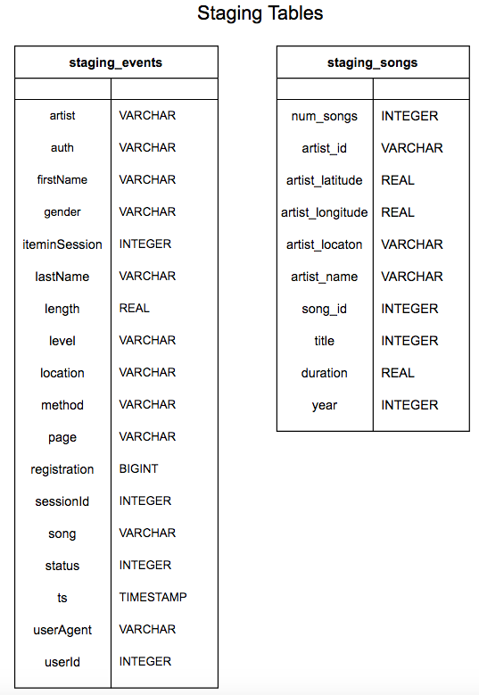
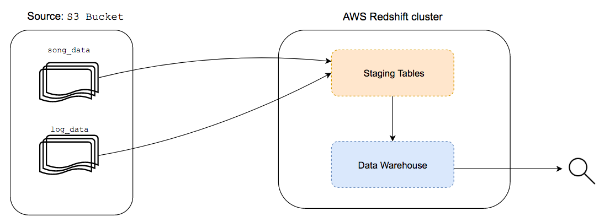
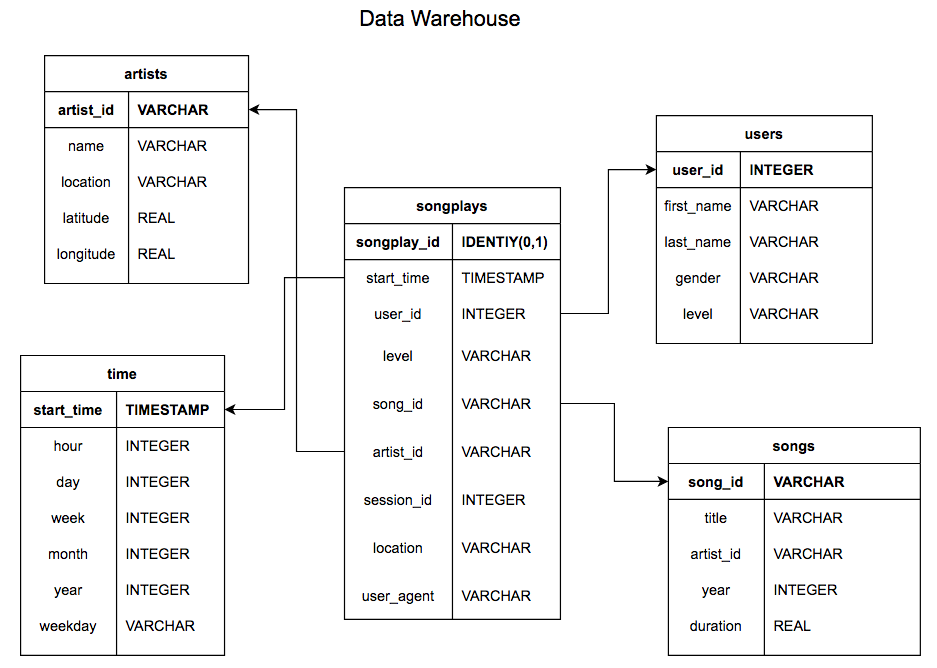
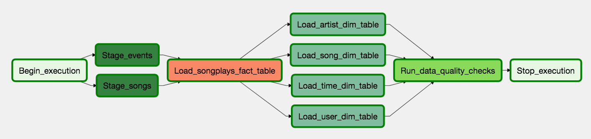

# Data Pipeline

## Objective

---

Automate the process of creating a data warehouse, through a ETL pipeline orchestrated with **Airflow**, of Sparkify's users activity from several **large** sources to enable fast queries of data on AWS Redshift.

## Implementation

---

### ETL pipeline

We are dealing with large amount of data and we have the need to transform it to allow further analysis. Below is explained this process.

##### Source
We have two sources that are stored in a AWS S3 bucket: 
- Songs Dataset: [Million Song Dataset](http://millionsongdataset.com/).
- Logs Dataset: Activity logs of users using the Sparkify app.

##### Extraction
Since we need to extract large amounts of data for later transformations, as first step the data is copied, from the source, to *stagging tables* in a AWS Redshift cluster. This is a good practice to load data from AWS S3 since we can use the COPY command that allows to do this process in parallel. The staging tables are visualize below:

##### Tranformation and Loading
Given that the *logs dataset* only have metadata about user's activity we must extract the information about songs from the *songs dataset*. To do so, the data from the staging tables was transformed and loaded into the data warehouse tables. It should be noted that this data warehouse is stored in a AWS Redshift cluster that allows fast queries of the data. 

#### Schema

The data warehouse have a star schema optimized for queries on song play analysis. The names of the songs provided on the *logs dataset* are used to create the *songs* and *artists* tables extracting the relevant information from the *songs dataset*. The attributes of users are stored in the *users* table. Finally, attributes regarding the time of logs are created and stored in the *time* table. The data warehouse have a star schema that simplifies queries and is used commonly for online analytics processing. The tables are as follows:

- Fact Table
    - `songplays`: Logs of songs plays 
    
- Dimension Tables
    - `users`: Contains users attributes
    - `songs`: Contains songs attributes
    - `artists`: Contains artists attributes
    - `time`: Contains time attributes

The schema can be visualize as follows:

## Data Pipeline

The ETL pipeline was orchestrated with Airflow with the following tasks

- Stage_events: Extract log data from S3 and stages it to `staging_events` table

- Stage_songs: Extract song data from S3 and stages it to `staging_songs` table

- Load_songplays_fact_table: Creates `songplays` table from staging tables data

- Load_artist_dim_table: Creates `artists` table from staging tables and `songplays` table data

- Load_song_dim_table: Creates `songs` table from staging tables and `songplays` table data

- Load_time_dim_table: Creates `time` table from staging tables and `songplays` table data

- Load_user_dim_table: Creates `users` table from staging tables and `songplays` table data

- Run_data_quality_checks: Check data quality of tables

### Files

- `airflow/dags/sparkify_dag.py`: Specifies the DAG of the data pipeline

- `airflow/plugins/operators/stage_redshift.py`: Define operator to load data from S3 to staging table in AWS Redshift

- `airflow/plugins/operators/load_dimension.py`: Define operator to load data to dimensional table

- `airflow/plugins/operators/load_fact.py`: Define operator to load data to fact table

- `airflow/plugins/operators/data_quality.py`: Define operator to check data quality

- `airflow/plugins/helpers/sql_queries.py`: File with the sql queries

## Instructions

---

On the the terminal on working directory do the following:

1. Run `export AIRFLOW_HOME=/PATH/TO/WORKING_DIRECTORY/airflow`

2. Run `airflow db init`

3. Run `airflow webserver` to launcha Airflow UI

4. Run on **another** terminal `airflow scheduler` 

5. Go to `localhost:8080`

6. Save Redshift cluster connection and AWS credentials on the *Connections* page from the Airflow UI

7. Run *sparkify* DAG

## Requirements

- `sqlite > 3.13 `

- `python 3.6.10`

- `airflow 2.0.1`

- `psycopg2`